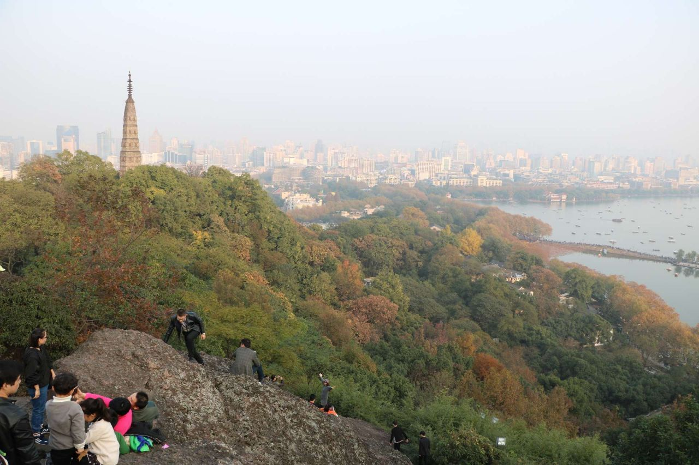
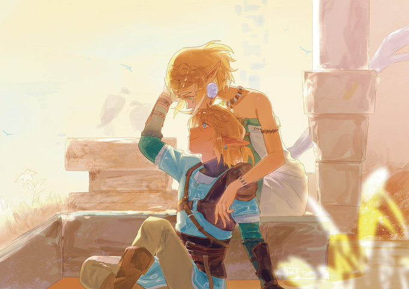
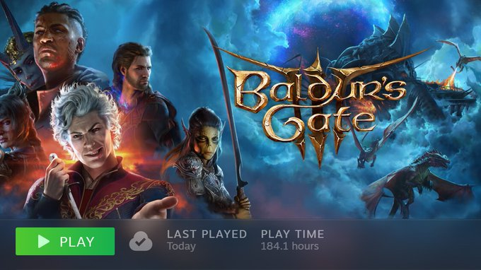
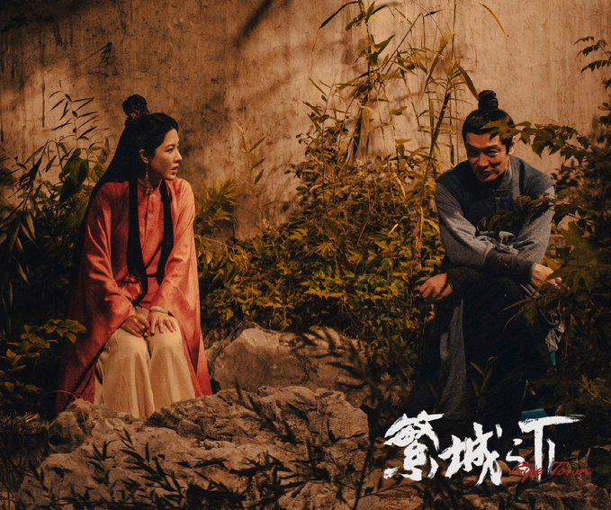


霜降时节，万物毕成，毕入于戌，阳下入地，阴气始凝，天气渐寒始于霜降。


## 登高远眺

秋季山林、高山空气新鲜，大气中的浮尘和污染物较少。霜降时节登高远眺，既可使肺的功能得到舒畅，同时登至高处极目远眺，心旷神怡，还可舒缓心情。

闲来无事，身体因好久没运动，渐渐无活力，遂去宝石山爬山，调养身心，汲取大自然精气；

### 博客的古往今来

- 使用博客原因：
	- 朋友圈已经好长时间搁置不使用，主要是烦好多好友一天到晚在朋友圈发宣传之类的一些没有实际营养价值的分享，当然微信还有一堆自己的广告，即使手动关掉了后面还是会接二连三的出现，可能微信是处于打广告盈利的手段，但这些真的很影响朋友圈的体验。所以痛定思痛之后，还是放弃了多年陪伴多年的朋友圈；
	- 现在处于一个信息快速传播的年代，短信息方便快捷，及时有效，但你有没有发现容易忘记，所以为了能记录自己生活的点滴和思考自己的生活，长文字的记录显的还是有必要的；

- 终于下定决心，自己按照攻略搭建博客，之前一直不知道博客对于现阶段的知识青年到底有何意义，而且感觉入门门槛比较高，需要自己搭建网站和日常维护啊，反正一堆事情。也不知道哪里来的冲动，经历了几次物是人非的事情之后，发觉自己的人生还是有点必要留下一些记忆；到时候老了可以下酒；
- 教程网上有好多，也不想按部就班的再写一边，但还是要感谢一下小球飞鱼的教程[Hugo | Hugo-stack-theme 主题魔改版 | 小球飞鱼](https://mantyke.icu/posts/2022/stack-theme-mod/)，写的很好，一个礼拜差不多就搭建完了自己的博客；后期再想着如何装修吧，至少现在用的还可以；

### 前有塞尔达王国之泪，后有博德之门3

- 时隔5个月终于将塞尔达王国之泪通关，确实很优秀，站在巨人的肩膀上就是厉害，但也仅此而已，接下来随便聊聊玩完之后的感受：
	- 量大管够：
		- 在前作基础上对海拉鲁大陆进行了大量细节上的修改：地方还是哪个地方，但已经物是人非；
		- 还有这次居然可以上天入地，空中岛屿设计的都很出色，但地底就稍显逊色多了，剧情上面也将三者结合的天衣无缝。
	- 玩法大胆创新：
		- 究极手：只要你能想到的，没有你做不到的，开发大脑，进军第四次工业革命；
		- 通天穿：Boss新打法，上山新路径，钻就够了，省时省力；
		- 时间倒退：再也不怕搭不上车了；
- 搜集管够：山洞真的好多，衣服真的好多，地下还有120个灯，不变的999个呀哈哈，还有机器人，三头龙.....根本玩不过来；赶紧先通关好了，后面慢慢搜集吧，有时间在玩；
- 前期有多惊艳，后面真的玩的有多累，152个迷宫解谜比荒野之息还是稍显逊色，没有挑战性，没有守护灵了，进去随便操作一顿就过了，当然也有好的设计，但也就几个；
- 打算后期MK3开图吧，省事，真的有点累了，接下来的目标就是地底120个灯点亮，衣服找齐，就行了。

### 博德之门3

- 自法环之后，又一款让我沉醉在幻想里无法自拔的游戏。将你的心与我交织，让熟睡的灵魂展翅翱翔，带我度过这个美妙夜晚，沿河徜徉。目前还没通关，最近所有时间都放着上面了。
- 年度黑马，今年的TGA大概率是它，开创了crpg新时代，估计未来会有更多同类型游戏；
- 说句实话在玩之前真的不是很喜欢这种类型的游戏，也是第一次听说crpg，地下城与勇士，入门也很难；
- 直到好友强烈推荐，以试试心态去玩了一下，越往后面越一发都不可收拾；得承认确实很难入门，搞不好就是团灭，回档了好几次；
- 很多专业术语，都得熟悉一边，死了一大片脑细胞，比如优势，你要自己制造优势，不同的职业会有不同优势定义，刺客需要隐秘优势，投掷流蛮族需要高度优势，等等。
- 还有一大堆职业，牧师上buff，法师群体攻击，根本玩不过来，可能每一个职业都是一个全新的游戏；有些职业就是嘴炮流，省时省力；历史，交际等等很多属性，都影响游戏判定；
- 每个支线质量都很高，是目前玩过所有游戏里最棒的一个，没有之一，料真的很足，故事很丰满，人物塑造的有血有肉，有些人物甚至会贯穿剧情始终。
- 每个区域都经过精心设计，有很多暗门密道，不好好找，可能还发现不了，洛山达之血没解密就是整个城镇坍塌。
- 庞大复杂的剧情网络，充满想象力的美术设计，深度构筑的世界架构，甚至还将演出表现力做到了高规格电影叙事游戏的水平；尤其要说凯瑟里克Boss战，张力压迫感十足，一度以为自己打不过。

### 繁城之下

- 可以说是10月份最好的网剧了，慢慢道来，不拖沓，也确实悬疑，每集都会死一个人；
- 有必须要说一下色调，我很喜欢，是一种特有的江南电影色调，江南烟雨的深色，多少江南烟雨中的感觉；
- 前面都还好，但细细想想感觉结尾还是有点刻意了，县令我觉得还是陆不忧比较合理，复仇有因，家族灭门，深仇大恨，显得合情合理；但结尾凶手原来是小平子，就感觉动机太单纯，难道是陆不忧接纳他？把他当好朋友，救命之恩；救命之恩也可以理解，但就觉得刻画还是太少，不够自然；
